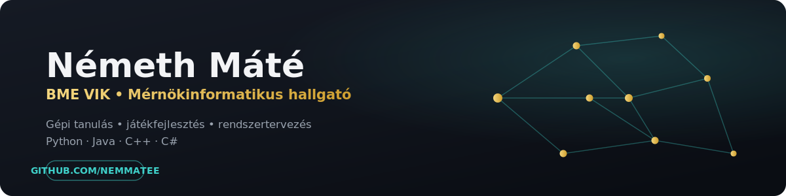
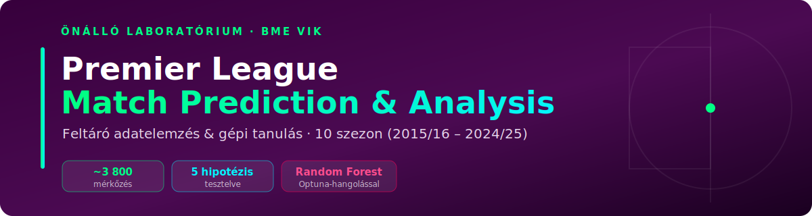
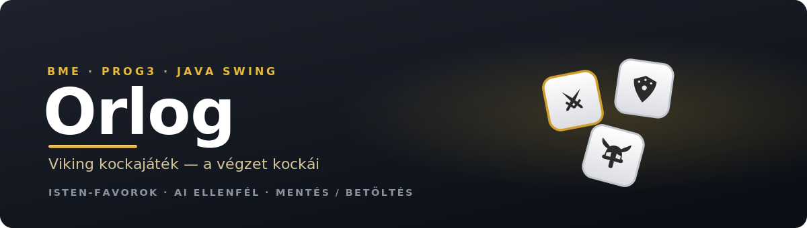
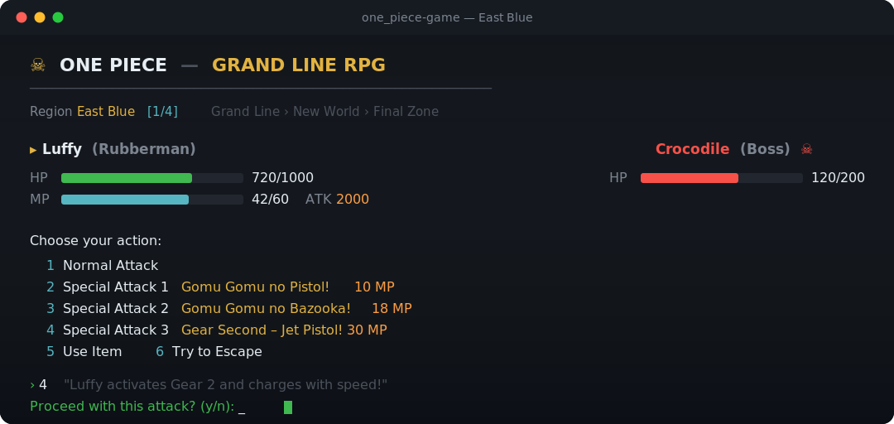
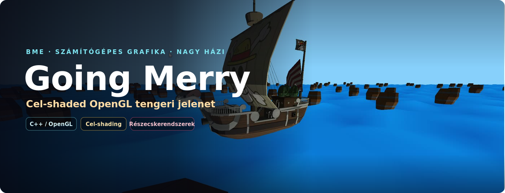
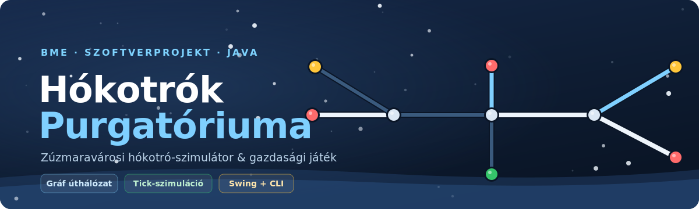

 

 

## Rólam

BME VIK mérnökinformatikus hallgató vagyok. A féléves házi feladatokat és a szabadidős projekteket is szeretem végigvinni egy olyan szintre, ahol már nem csak "beadható", hanem szívesen megmutatom — legyen szó gépi tanulásról, játékfejlesztésről vagy rendszerszintű programozásról.

- 🔭 Jelenleg: Önálló Laboratórium (Premier League predikció), TDK jelölt téma
- 🧠 Érdeklődés: gépi tanulás, adatelemzés, játékfejlesztés (C++ / Java), rendszertervezés
- 🌱 Tanulom: mélyebb ML-modellezés, RAG-alapú rendszerek

## Kiemelt projektek

<table>
<tr>
<td width="50%" valign="top">

**[Premier League Predikció](https://github.com/Nemmatee/premier-league-onlab)** · Önálló Labor
 

Feltáró adatelemzés és Random Forest + Optuna alapú predikciós modell 10 szezonnyi PL-adaton.

</td>
<td width="50%" valign="top">

**[Orlog — viking kockajáték](https://github.com/Nemmatee/prog3_orlog_nagyhf)** · Prog3 nagy házi
 

Java Swing kockajáték isten-favorokkal, AI ellenféllel és mentés/betöltéssel.

</td>
</tr>
<tr>
<td width="50%" valign="top">

**[One Piece — konzoljáték](https://github.com/Nemmatee/new_one_piece)** · Prog2 nagy házi
 

Karakter- és képességrendszerre épülő terminálos harci játék, egyedi ANSI-színezésű konzol UI-val.

</td>
<td width="50%" valign="top">

**[Going Merry](https://github.com/Nemmatee/grafika_hazi)** · Grafika nagy házi
 

3D hajó-szimuláció OpenGL/C++-ban: dinamikus vízfelszín, kamera- és fényrendszer.

</td>
</tr>
<tr>
<td width="50%" valign="top">

**[Hókotrók Purgatóriuma](https://github.com/Nemmatee/Hokotrok-Purgatorium)** · Csapatos projekt
 

Gráfalapú pályán zajló csapatos Java projekt — saját, független biztonsági mentés.

</td>
</tr>
</table>

további féléves projektek és feladatmegoldások a repók között

